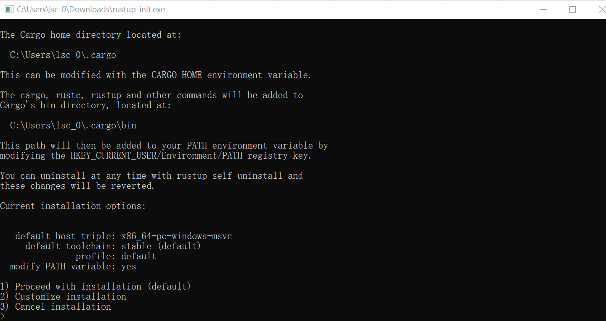
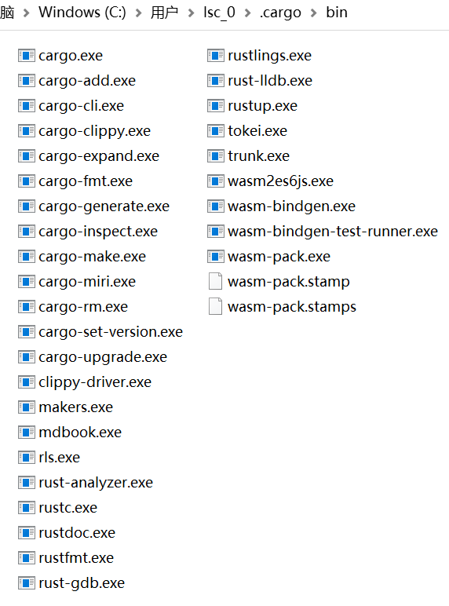
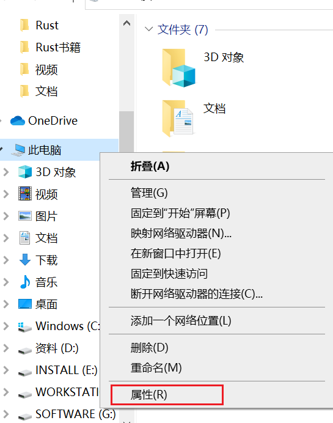
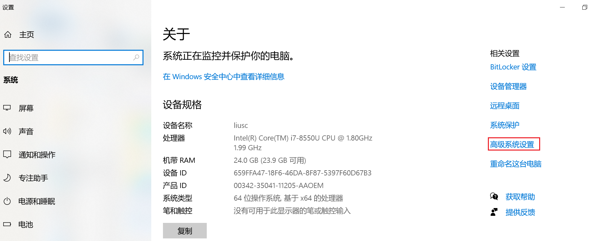
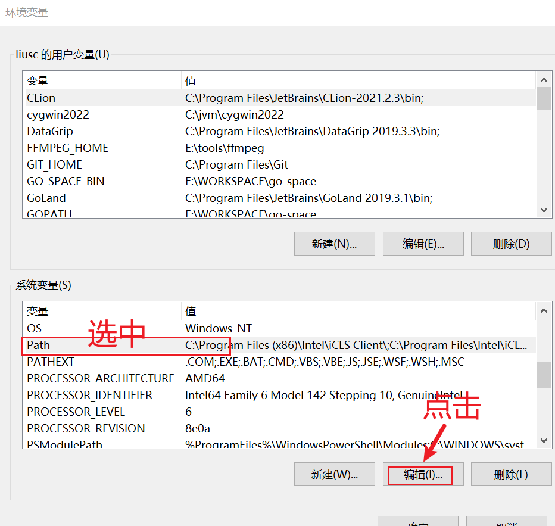
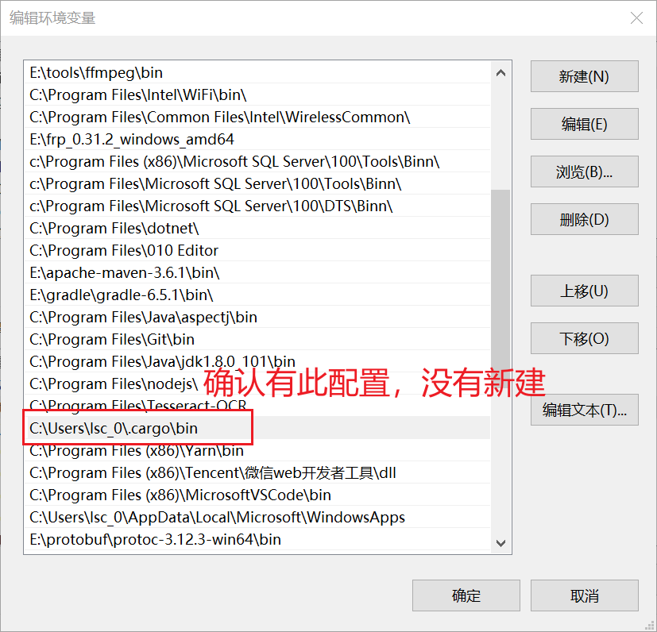

## Windows

#### 安装步骤

[线上Coding编辑器](https://play.rust-lang.org/)

- 下载安装包：RUSTUP-INIT.EXE (64-BIT)

- 双击安装，全部回车，默认安装的是`x86_64-pc-windows-msvc`

  
  

Cargo的安装目录：`C:\Users\lsc_0\.cargo`
编辑config文件换国内源，本机配置如下：
```txt
# [source.crates-io]
# registry = "https://github.com/rust-lang/crates.io-index"

#replace-with = 'tuna'

# [source.tuna]
# registry = "https://mirrors.tuna.tsinghua.edu.cn/git/crates.io-index.git"

# 中国科学技术大学
# replace-with = 'ustc'
# [source.ustc]
# registry = "https://mirrors.ustc.edu.cn/crates.io-index"

# 字节提供
[source.crates-io]
replace-with = 'rsproxy'

[source.rsproxy]
registry = "https://rsproxy.cn/crates.io-index"

[registries.rsproxy]
index = "https://rsproxy.cn/crates.io-index"

[net]
git-fetch-with-cli = true
```
Cargo中bin目录下可执行文件如图：

执行文件说明：
```txt

rustup.exe：工具链管理
rustc.exe：编译器
cargo.exe：包管理器
cargo-fmt.exe和rustfmt.exe：源代码格式化工具
rust-gdb.exe和rust-lldb.exe：调试器
rustdoc.exe：文档生成器
rls.exe和racer.exe：编辑器准备的代码提示工具

```
- 验证是否安装成功
```shell
// rustup是管理rust工具链下载更新的工具
C:\Users\lsc_0>rustup -V
rustup 1.24.3 (ce5817a94 2021-05-31)
info: This is the version for the rustup toolchain manager, not the rustc compiler.
info: The currently active `rustc` version is `rustc 1.59.0 (9d1b2106e 2022-02-23)`

// rustc是rust的编译器
C:\Users\lsc_0>rustc -V
rustc 1.59.0 (9d1b2106e 2022-02-23)

// cargo是rust的包管理器
C:\Users\lsc_0>cargo -V
cargo 1.59.0
```
rustup工具链命令：

```
// 更新rustup本身
C:\Users\lsc_0> rustup self update
// 卸载rust所有程序
C:\Users\lsc_0> rustup self uninstall
// 更新工具链
C:\Users\lsc_0> rustup update

// 安装nightly版本的编译工具链
C:\Users\lsc_0> rustup install nightly
// 设置默认工具链是nightly版本
C:\Users\lsc_0> rustup default nightly
```


- 如果验证失败，提示没有此命令，检查系统环境配置，如没有配置，需要根据你电脑中cargo的安装路径进行手动配置，注意一定要配置bin目录










## Linux/MacOS

安装命令：`curl --proto '=https' --tlsv1.2 -sSf https://sh.rustup.rs | sh`


